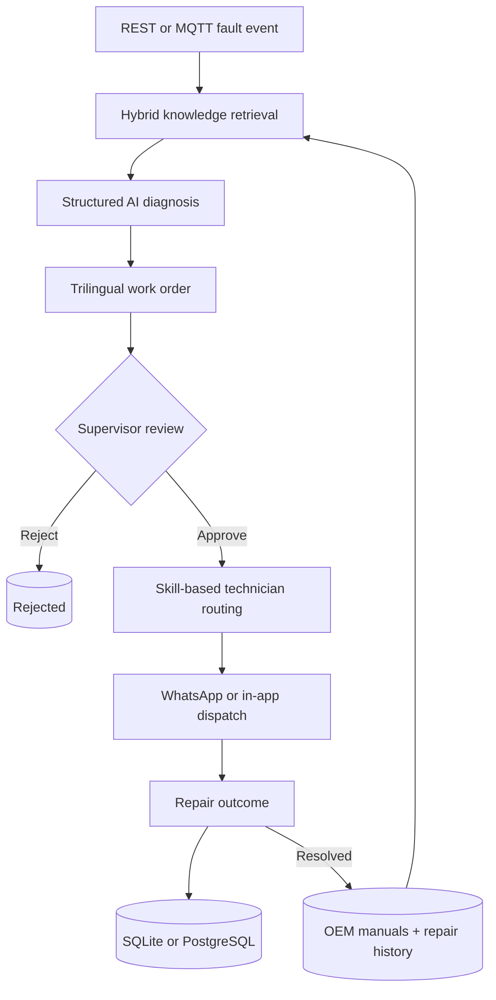

<div align="center">
  

  [](https://github.com/Goodnight77/TORQ/actions/workflows/ci.yml)
  
  
  
  
  
</div>

<p align="center">
  <a href="#why-torq">Why TORQ</a> ·
  <a href="#pipeline">Pipeline</a> ·
  <a href="#quick-start">Quick start</a> ·
  <a href="#api">API</a> ·
  <a href="#development">Development</a>
</p>

## What is TORQ?

TORQ is an event-driven predictive-maintenance engine that turns machine faults into grounded diagnoses, approval-ready work orders, and technician dispatches.

A fault arrives over REST or MQTT. TORQ retrieves relevant OEM guidance and past repairs, asks an OpenAI-compatible model for a structured diagnosis, creates an English/French/Arabic work order, and queues it for supervisor review. Resolved repairs return to the knowledge base so the next diagnosis can reuse what worked.

## Why TORQ?

| Traditional maintenance flow | TORQ |
| --- | --- |
| Faults wait to be noticed and triaged | REST and MQTT fault ingestion starts the workflow immediately |
| Technicians search manuals and logs by hand | Dense + BM25 retrieval surfaces relevant guidance and repair history |
| Diagnosis quality depends on who is available | Structured, source-aware AI diagnosis creates a consistent starting point |
| Work orders are manually written and translated | Approval-ready EN/FR/AR work orders and PDFs are generated automatically |
| Dispatch is based on availability alone | On-shift technicians are matched by skill, then contacted in their preferred language |
| Repair knowledge disappears into notes | Successful outcomes are re-indexed for future diagnoses |

## Pipeline



## Features

### Retrieval-grounded diagnosis

TORQ combines dense embeddings and BM25 sparse search in Qdrant, fuses the results with reciprocal rank fusion, and optionally reranks them with a cross-encoder. Diagnoses use both OEM manual excerpts and machine-specific repair history before falling back to broader historical matches.

### Approval-first work orders

Each diagnosis becomes a persistent work order with root cause, repair steps, parts, tools, safety warnings, confidence, and source references. English content is deterministic; French and Arabic translations are produced in one additional model call. PDFs support shaped, right-aligned Arabic using the bundled Amiri font.

### Smart technician dispatch

Fault-code prefixes map to maintenance skills, and TORQ selects an on-shift technician with the closest match. Approved work orders can be delivered through Twilio WhatsApp, with an in-app delivery response when Twilio is not configured.

### Closed-loop learning

When a repair is marked resolved, TORQ records the actual fix, technician notes, and time to repair. The result is appended to repair history and the history index is rebuilt, making the successful fix available to later diagnoses.

### Supervisor and operations views

The built-in dashboard supports fault simulation, approval, rejection, resolution, and downtime metrics. A separate React dashboard adds work-order details, multilingual content, PDF downloads, retrieval evaluation charts, and an editable ROI calculator.

### Multiple integration surfaces

Use TORQ through its REST API, MQTT listener, React dashboard, or MCP server. The MCP interface exposes manual and repair-history search as standalone tools for compatible AI clients.

## Quick start

### Prerequisites

- [Python 3.11+](https://www.python.org/)
- [uv](https://docs.astral.sh/uv/)
- Node.js 18+ and npm only for the optional React dashboard

### Run the no-key demo

The fastest way to exercise the complete workflow is the in-process demo. When `LLM_API_KEY` is unset, it uses a mocked diagnosis and does not call an external model.

```bash
git clone https://github.com/Goodnight77/TORQ.git
cd TORQ
uv sync --dev
uv run python scripts/run_loop.py
```

This runs fault submission → approval → dispatch → outcome feedback → metrics without starting a server.

### Run the live API

```bash
cp .env.example .env
# Add LLM_API_KEY to .env for live diagnosis
uv run uvicorn torq.api.main:app --reload
```

Open:

- Dashboard: [localhost:8000](http://localhost:8000)
- Swagger UI: [localhost:8000/docs](http://localhost:8000/docs)
- ReDoc: [localhost:8000/redoc](http://localhost:8000/redoc)

> Live fault submission requires a configured OpenAI-compatible model. Only `scripts/run_loop.py` provides the no-key mocked diagnosis.

### Run the React dashboard

With the API running in another terminal:

```bash
cd web
npm ci
npm run dev
```

Open [localhost:5173](http://localhost:5173). Vite proxies `/api` requests to the FastAPI server on port `8000`.

## Configuration

TORQ reads `.env` from the repository root. Most integrations are optional and have local fallbacks.

| Variable | Purpose | Default behavior |
| --- | --- | --- |
| `LLM_API_KEY` | Enables live diagnosis and FR/AR translation | No live fallback; the demo script mocks diagnosis |
| `LLM_BASE_URL` | OpenAI-compatible API endpoint | `https://api.deepseek.com` |
| `LLM_MODEL` | Model used for diagnosis and translation | `deepseek-reasoner` |
| `QDRANT_URL`, `QDRANT_API_KEY` | Connect to hosted Qdrant | Local on-disk Qdrant under `data/qdrant_storage/` |
| `DATABASE_URL` | Use PostgreSQL for work orders and machines | SQLite at `data/torq.db` |
| `TWILIO_ACCOUNT_SID`, `TWILIO_AUTH_TOKEN`, `TWILIO_WHATSAPP_FROM` | Enable WhatsApp dispatch | In-app delivery response |
| `MQTT_BROKER_URL`, `MQTT_PORT`, `MQTT_TOPIC` | Configure machine fault events | Public HiveMQ demo broker and `torq/demo/faults` topic |

Retrieval models, collection names, paths, chunk size, result count, hybrid search, and reranking can also be overridden through environment variables defined in `src/torq/config.py`.

## Knowledge base

The repository intentionally does not include operational OEM manuals or repair logs. Add your own data before running live retrieval:

- Place top-level `.md` or `.txt` manuals in `data/manuals/`.
- Add repair records to `data/history/repairs.json`.
- Index both collections:

```bash
uv run python -m torq.ingest.manuals
uv run python -m torq.ingest.history
```

On first use, FastEmbed may download the configured embedding, sparse, and reranking models. Ingestion recreates each Qdrant collection from the source files.

## API

| Method | Endpoint | Description |
| --- | --- | --- |
| `GET` | `/api/machines` | List registered machines |
| `POST` | `/api/machines` | Register a machine |
| `POST` | `/api/faults` | Diagnose a fault and create a pending work order |
| `GET` | `/api/work-orders` | List work orders, optionally filtered by `status` |
| `GET` | `/api/work-orders/{id}` | Get a work order |
| `GET` | `/api/work-orders/{id}/pdf` | Generate or download its PDF |
| `POST` | `/api/work-orders/{id}/approve` | Route and dispatch an approved work order |
| `POST` | `/api/work-orders/{id}/reject` | Reject a work order |
| `POST` | `/api/work-orders/{id}/outcome` | Record repair results and feedback |
| `GET` | `/api/metrics` | Return workflow and downtime metrics |
| `GET` | `/api/eval` | Return precomputed retrieval evaluation results |

Example fault submission:

```bash
curl -X POST http://localhost:8000/api/faults \
  -H "Content-Type: application/json" \
  -d '{
    "fault_code": "E-471",
    "machine": "CM-350 Line 2",
    "context": "Motor tripped after several hours of operation."
  }'
```

## Development

### Useful commands

| Command | Purpose |
| --- | --- |
| `uv run python scripts/run_loop.py` | Run the mocked end-to-end API loop |
| `uv run python scripts/run_pdf.py` | Generate and validate a multilingual work-order PDF |
| `uv run python scripts/run_brain.py` | Ingest knowledge and diagnose the seeded scenarios |
| `uv run python scripts/run_action.py` | Exercise fault → approval → dispatch with live diagnosis |
| `uv run python scripts/run_mqtt.py` | Exercise the MQTT listener and simulator |
| `uv run python scripts/run_mcp.py` | Smoke-test MCP manual and history search tools |
| `uv run python scripts/eval_retrieval.py` | Compare dense, hybrid, and reranked retrieval |
| `uv run python scripts/eval_diagnosis.py` | Evaluate diagnoses with an LLM judge |

Commands other than the mocked loop and PDF smoke test may require indexed knowledge, live model credentials, or external services.

### Tests

```bash
uv run pytest tests/ -v
```

The test suite covers pipeline orchestration, database selection and compatibility, machine registration, API machine routes, and downtime metrics. GitHub Actions runs the PDF smoke test, end-to-end loop, and unit tests on Python 3.11 and 3.12 for pull requests to `main`.

## Project structure

```text
src/torq/
├── agent/          Structured diagnosis, prompts, and schemas
├── api/            FastAPI application, routes, and built-in dashboard
├── db/             SQLite/PostgreSQL persistence and metrics
├── dispatch/       Approval, technician routing, and notifications
├── events/         MQTT listener and fault simulator
├── ingest/         Manual/history ingestion and hybrid retrieval
├── knowledge/      Repair-outcome feedback loop
├── mcp/            MCP knowledge-search server
├── workorder/      Multilingual work-order and PDF generation
├── config.py       Environment-backed runtime settings
└── pipeline.py     End-to-end fault orchestration

web/                React + Vite supervisor dashboard
data/               Scenarios, technician shifts, and evaluation fixtures
scripts/            Demo, integration, PDF, and evaluation runners
tests/              Unit and API tests
assets/              Logos and PDF fonts
```

## Tech stack

| Layer | Technology |
| --- | --- |
| API and validation | FastAPI, Pydantic |
| AI | OpenAI-compatible chat completions |
| Retrieval | Qdrant, FastEmbed, dense + BM25, RRF, cross-encoder reranking |
| Events and tools | MQTT, MCP |
| Persistence | SQLite by default, optional PostgreSQL |
| Dispatch | Twilio WhatsApp with in-app fallback |
| Documents | fpdf2, HarfBuzz, Amiri font |
| Dashboard | React 18, Vite |
| Tooling | uv, pytest, GitHub Actions |

## Project status

TORQ is an active prototype built for demonstration and experimentation. The API currently has no authentication, CORS is open for local development, workflow processing is synchronous, and the default MQTT broker is public. Add production-grade identity, authorization, transport security, queues, retries, and observability before deploying it in an industrial environment.
